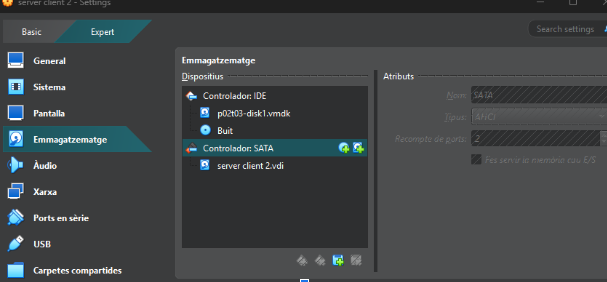

# 🔐 T03: Seguretat Lògica: recuperant accés a sistemes

Primer de tot hem de copiar de la comuna el disk a un lloc en el que el programa VM pugui accedir. Un cop això fet, hem de ficar el disc que hem copiat com a principal; un cop fet això iniciarem la màquina.

