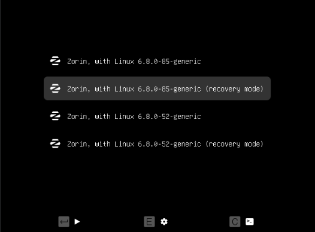
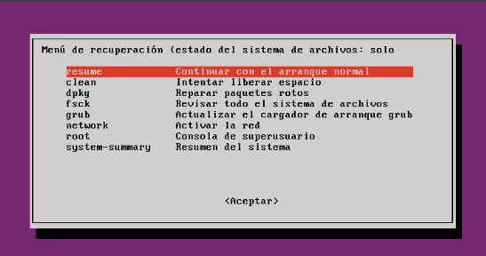
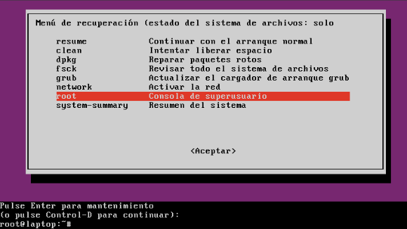
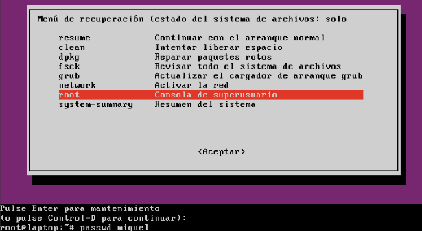
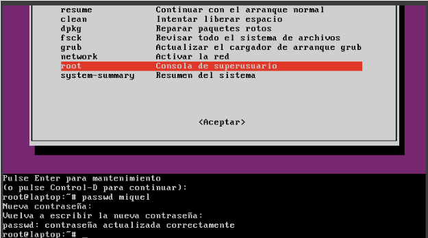

# 🔐 T03: Seguretat Lògica: recuperant accés a sistemes

Primer de tot hem de copiar de la comuna el disk a un lloc en el que el programa VM pugui accedir. Un cop això fet, hem de ficar el disc que hem copiat com a principal; un cop fet això iniciarem la màquina.


## 💻 Accés a la màquina virtual i problema de contrasenya
Un cop haguem entrat a la màquina virtual trobarem que no podem accedir ja que tenim un compte amb la contrasenya i el que hem de fer és canviar la contrasenya per poder accedir-hi.


## 🔁 Entrar en mode recovery (GRUB)
Ara hem de reiniciar la màquina i, mentre està iniciant-se, hem de fer `Shift` + una tecla qualsevol. Un cop haguem pressionat aquestes tecles s’obrirà un menú el qual hem de pressionar **Advanced options for Ubuntu**; després de pressionar aquesta opció ens sortirà aquest menú i hem de triar la **segona opció**.



Un cop hem triat la segona opció s’obrirà un altre menú en el qual hem de triar l'opció **root**.






Un cop hem entrat a `root`, ens deixarà ficar comandes.  
La comanda que hem de ficar és:

```
passwd miquel
```






Un cop hem fet aquesta comanda ja ens deixa ficar la nova contrasenya d’aquest usuari.  
La nova contrasenya d’aquesta màquina virtual és: **usuari123**.  

Un cop fet això, reiniciem la màquina i ja podrem accedir-hi.  

Ara hem d’entrar al mode `root` un altre cop.  

Un cop a dins, el que volem fer és que poca gent pugui accedir al **GRUB**.  
Llavors, hem d’entrar un altre cop per canviar la configuració amb aquest comandament:


```bash
sudo grub-mkpasswd-pbkdf2
```
Això ens generarà la contrasenya que li indiquem, però **xifrada**.

## ✏️ Editar la configuració del GRUB

Ara per editar l’arxiu hem d’entrar amb aquesta comanda:

```bash
sudo nano /etc/grub.d/40_custom
```
Un cop aquí, hem d’afegir les següents línies.

set superusers="miquel"
grub.pbkdf2.sha512.10000.A1B2C3D4E5F60718293A4B5C6D7E8F9A0B1C2D3E4F5061728394A5B6C7D8E9F0A1B2C3D4E5F67A8B9C0D1E2F3A4B5C6D7E8F9A0B1C2D3E4F5A6B7C8D9E0F1A2B3C4D5E6F7A8B9C0

Per últim, actualitzem el GRUB:
```
sudo update-grub
```

Un cop hem actualitzat fem un:
```
sudo re
```


Un cop fet tot aixó reinciem la Màquina Virtual, intenem entrar al GRUB i ens demanara el nom de l'usuari i contrasenya.


