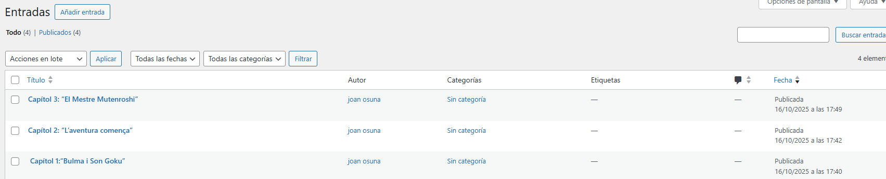
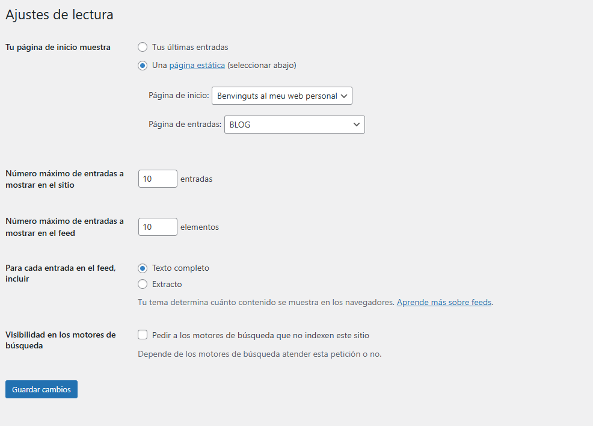

# 🖥️ Nom del web creat
**Benvinguts al meu web personal**

##  Diferència entre pàgines i entrades

| Característica | **Pàgines** | **Entrades (Posts)** |
|-----------------|--------------|----------------------|
| **Funció** | Contingut fix i permanent (ex. “Inici”, “Contacte”) | Contingut dinàmic i actualitzable (ex. articles, notícies, opinions) |
| **Organització** | No es classifiquen per categories ni etiquetes | Es poden agrupar per **categories** i **etiquetes** |
| **Aparició al web** | Es mostren al menú principal | Es mostren al **Blog**, ordenades per data |
| **Exemple** | “Benvinguts al meu web personal”, “Les meves mascotes”, “Contacte” | “Opinió sobre una sèrie - Capítol 1”, “Capítol 2”, “Capítol 3” |

##  Pàgines creades

###  Pàgina 1: *Benvinguts al meu web personal*
Hola! Em dic Joan i actualment estic estudiant el cicle formatiu de Sistemes Microinformàtics i Xarxes.  
M’apassiona la tecnologia, els videojocs i la informàtica. Aquest curs espero aprendre molt sobre administració de xarxes, seguretat informàtica i creació de llocs web.  
Aquest és el meu primer web creat amb WordPress i m’encanta el resultat!

### Pàgina 2: *Les meves mascotes*
A casa tinc un gat anomenat *Pixel*. És molt curiós i li agrada dormir damunt del teclat mentre programo 😺.  
De vegades juga amb una pilota de paper com si fos un caçador professional.  
Si no tingués un gat, segur que tindria un Pokémon com *Eevee*, seria genial!

###  Pàgina 3: *Blog*
Aquesta pàgina no té contingut directe — és on WordPress mostrarà automàticament totes les **entrades del blog**.

###  Pàgina 4: *Contacte*
 Si vols contactar amb mi per parlar de sèries, tecnologia o gats, pots escriure’m a través del formulari de contacte o deixar un comentari a qualsevol entrada del blog.  
 M’encantarà llegir-te!

## ✍️ Entrades del blog

###  Opinió sobre una sèrie - Capítol 1: *One Piece*
En aquest primer capítol coneixem en **Monkey D. Luffy**, un noi amb el somni de convertir-se en el Rei dels Pirates.  
El que més m’agrada és el seu esperit positiu i la seva valentia. A més, el disseny dels personatges i l’humor fan que sigui un inici molt entretingut.  
La combinació d’aventura i humor fa que t’atrapi des del primer moment.  
 

###  Opinió sobre una sèrie - Capítol 2: *El primer tripulant*
En aquest capítol apareix **Roronoa Zoro**, un espadatxí increïble que s’uneix a Luffy després d’un combat èpic.  
La història mostra com la confiança i l’amistat són claus en la tripulació.  
M’ha agradat molt l’escena final, on Zoro promet seguir el seu somni.  

###  Opinió sobre una sèrie - Capítol 3: *Nami, la lladre misteriosa*
 La introducció de **Nami** afegeix misteri i intel·ligència a la història.  
 És un personatge molt diferent dels altres: astuta, ràpida i amb un passat secret.  
 Aquest episodi m’ha agradat perquè mostra que no tots els pirates són iguals i que cadascú té motius propis per navegar.  

 

## ⚙️ Ajustaments configurats

###  Configuració → Lectura
- **Pàgina inicial:** mostra una pàgina estàtica  
- Pàgina d’inici: *Benvinguts al meu web personal*  
- Pàgina d’entrades: *Blog*
    

### 🎨 Aparença → Menús
Menú principal amb les opcions:
- 🏠 Inici  
- 🐾 Les meves mascotes  
- 📰 Blog  
- 💬 Contacte

