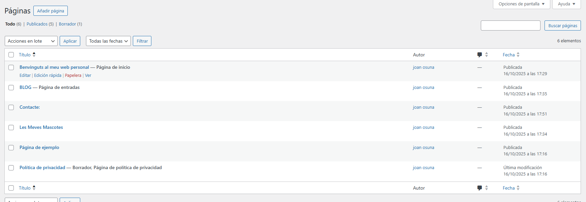

# 🖥️ Nom del web creat
**Benvinguts al meu web personal**

## 📸 Captures de pantalla del procés

1. Creació del lloc a **WP Local**  
2. Accés al **tauler de WordPress (Dashboard)**  
3. Pàgina principal **"Benvinguts al meu web personal"**  
4. Pàgina **"Les meves mascotes"**  
5. Pàgina **"Blog"** amb les tres entrades publicades  
6. Pàgina **"Contacte"**
   

## 🧩 Diferència entre pàgines i entrades

| Característica | **Pàgines** | **Entrades (Posts)** |
|-----------------|--------------|----------------------|
| **Funció** | Contingut fix i permanent (ex. “Inici”, “Contacte”) | Contingut dinàmic i actualitzable (ex. articles, notícies, opinions) |
| **Organització** | No es classifiquen per categories ni etiquetes | Es poden agrupar per **categories** i **etiquetes** |
| **Aparició al web** | Es mostren al menú principal | Es mostren al **Blog**, ordenades per data |
| **Exemple** | “Benvinguts al meu web personal”, “Les meves mascotes”, “Contacte” | “Opinió sobre una sèrie - Capítol 1”, “Capítol 2”, “Capítol 3” |

## 📝 Pàgines creades

### 🏠 Pàgina 1: *Benvinguts al meu web personal*
> Hola! Em dic Joan i actualment estic estudiant el cicle formatiu de Sistemes Microinformàtics i Xarxes.  
> M’apassiona la tecnologia, els videojocs i la informàtica. Aquest curs espero aprendre molt sobre administració de xarxes, seguretat informàtica i creació de llocs web.  
> Aquest és el meu primer web creat amb WordPress i m’encanta el resultat!

### 🐾 Pàgina 2: *Les meves mascotes*
> A casa tinc un gat anomenat *Pixel*. És molt curiós i li agrada dormir damunt del teclat mentre programo 😺.  
> De vegades juga amb una pilota de paper com si fos un caçador professional.  
> Si no tingués un gat, segur que tindria un Pokémon com *Eevee*, seria genial!

*(Afegeix una imatge d’un gat o d’un Pokémon amb el bloc “Imatge”)*

### 📰 Pàgina 3: *Blog*
Aquesta pàgina no té contingut directe — és on WordPress mostrarà automàticament totes les **entrades del blog**.

### 💬 Pàgina 4: *Contacte*
> Si vols contactar amb mi per parlar de sèries, tecnologia o gats, pots escriure’m a través del formulari de contacte o deixar un comentari a qualsevol entrada del blog.  
> M’encantarà llegir-te!

## ✍️ Entrades del blog

### 🏴‍☠️ Opinió sobre una sèrie - Capítol 1: *One Piece*
> En aquest primer capítol coneixem en **Monkey D. Luffy**, un noi amb el somni de convertir-se en el Rei dels Pirates.  
> El que més m’agrada és el seu esperit positiu i la seva valentia. A més, el disseny dels personatges i l’humor fan que sigui un inici molt entretingut.  
> La combinació d’aventura i humor fa que t’atrapi des del primer moment.  
> *(Imatge destacada: Luffy somrient amb el barret de palla)*  
> **Categoria:** Anime | **Etiquetes:** One Piece, Capítol 1, Opinió

### ⚓ Opinió sobre una sèrie - Capítol 2: *El primer tripulant*
> En aquest capítol apareix **Roronoa Zoro**, un espadatxí increïble que s’uneix a Luffy després d’un combat èpic.  
> La història mostra com la confiança i l’amistat són claus en la tripulació.  
> M’ha agradat molt l’escena final, on Zoro promet seguir el seu somni.  
> *(Imatge destacada: Zoro amb les seves tres espases)*  
> **Categoria:** Anime | **Etiquetes:** One Piece, Capítol 2, Zoro

### 🏴 Opinió sobre una sèrie - Capítol 3: *Nami, la lladre misteriosa*
> La introducció de **Nami** afegeix misteri i intel·ligència a la història.  
> És un personatge molt diferent dels altres: astuta, ràpida i amb un passat secret.  
> Aquest episodi m’ha agradat perquè mostra que no tots els pirates són iguals i que cadascú té motius propis per navegar.  
> *(Imatge destacada: Nami amb el mapa del Grand Line)*  
> **Categoria:** Anime | **Etiquetes:** One Piece, Capítol 3, Nami

## ⚙️ Ajustaments configurats

### ⚙️ Configuració → General
- **Títol del lloc:** Benvinguts al meu web personal  
- **Descripció curta:** Bloc d’un estudiant apassionat per la tecnologia i les sèries  
- **Fus horari:** Madrid  
- **Idioma del lloc:** Català  

### ⚙️ Configuració → Lectura
- **Pàgina inicial:** mostra una pàgina estàtica  
  - Pàgina d’inici: *Benvinguts al meu web personal*  
  - Pàgina d’entrades: *Blog*

### ⚙️ Configuració → Enllaços permanents
- Format seleccionat: **Nom de l’entrada** (més net i fàcil de llegir)

### 🎨 Aparença → Menús
Menú principal amb les opcions:
- 🏠 Inici  
- 🐾 Les meves mascotes  
- 📰 Blog  
- 💬 Contacte

